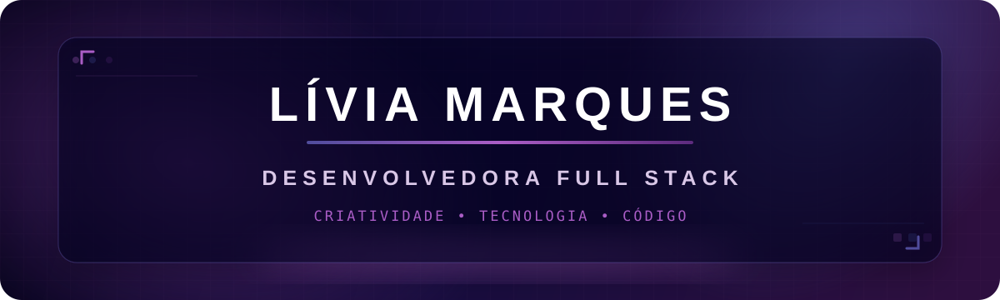
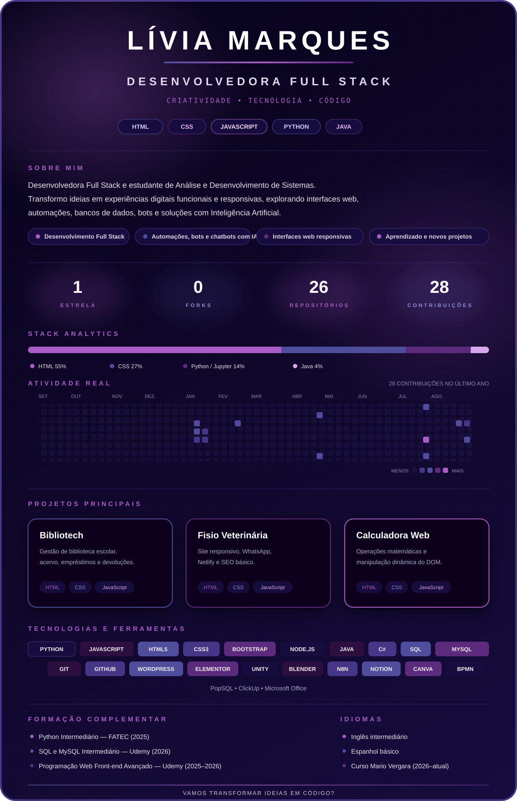

  

 

  
  

## Sobre mim

Sou **Lívia Marques**, Desenvolvedora Full Stack e estudante de **Análise e Desenvolvimento de Sistemas**. Gosto de transformar ideias em experiências digitais funcionais, responsivas e agradáveis, explorando desde interfaces web até automações, bancos de dados e soluções com Inteligência Artificial.

- 💻 Desenvolvimento Full Stack
- 🤖 Automação de tarefas, bots e chatbots com IA
- 🎨 Interfaces responsivas e experiências digitais
- 📚 Sempre aprendendo e construindo novos projetos

## Visão geral

  

  <a href="https://github.com/aalmmaa-group/Bibliotech">Bibliotech</a>
  &nbsp;•&nbsp;
  <a href="https://github.com/LiviaMq-dev/site-pet">Fisioterapia Veterinária</a>
  &nbsp;•&nbsp;
  <a href="https://github.com/LiviaMq-dev/Calculator">Calculadora Web</a>

## Tecnologias e ferramentas

Também trabalho com **PopSQL, BPMN, ClickUp e Microsoft Office**.

## Formação complementar

- **Python Intermediário** — FATEC (2025)
- **SQL e MySQL Intermediário** — Udemy (2026)
- **Programação Web Front-end Avançado** — Udemy (2025–2026)
- **Curso de Idiomas** — Mario Vergara (2026–atual)

## Idiomas

- 🇺🇸 Inglês intermediário
- 🇪🇸 Espanhol básico

  <strong>Vamos transformar ideias em código?</strong> 
  Entre em contato comigo pelo LinkedIn ou Instagram.

